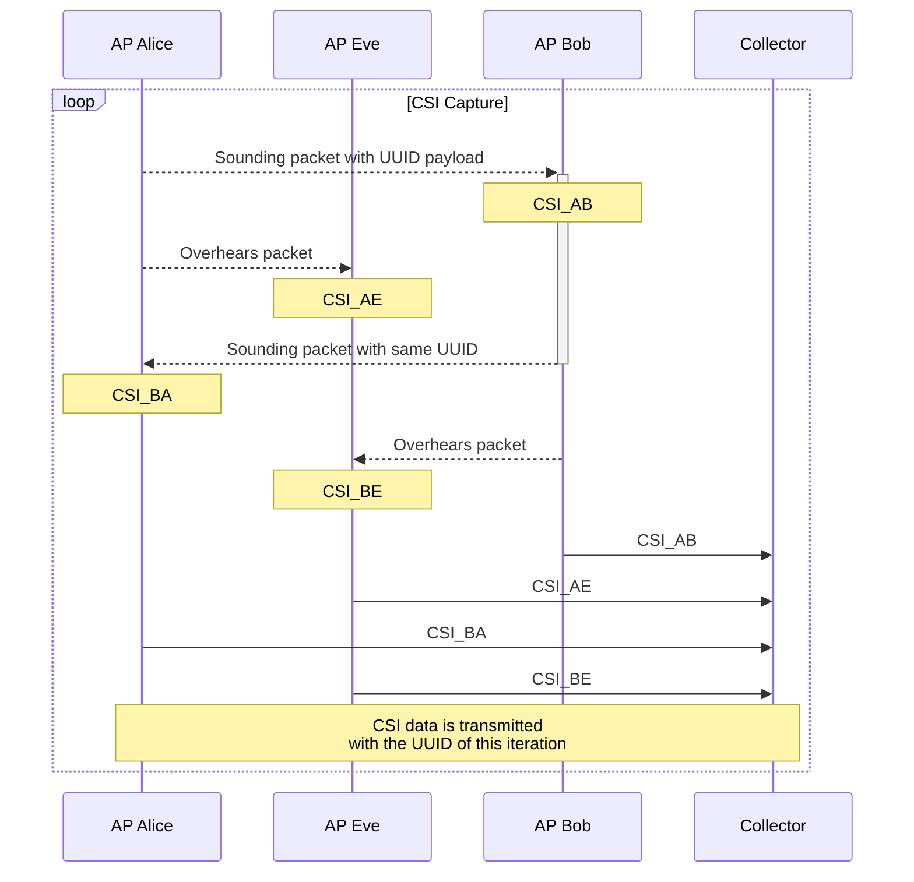

# CSI Testbed OpenWrt

This repository contains all the code and documentation for our testbed to experiment with channel state estimation (CSI) data.

The WiFi hardware we use has specific Atheros chipsets and is running OpenWrt.
Original modifaction of the kernel driver to extract the CSI data has been done [by this project](https://wands.sg/research/wifi/AtherosCSI/).

[Project for visualizing CSI data](https://github.com/Gi-z/CSIKit) we might write our own though.

[Datasheets of the Atheros Chips](https://github.com/Deoptim/atheros/)

## Functionality of the testbed

In the current stage we can use the testbed to collect CSI data of two APs for creating a common random variable.
More APs can be added to overhear the communication and do their own CSI extraction.

The following diagram show two legimate APs, Alice and Bob, and an passive listener Eve.
A server called Collector is used to capture the CSI data for simulations.

## Building OpenWRT images

This repository automatically builds OpenWRT images with all the needed patches and tools using Gitlab CI.
Images can be downloaded in the CI/CD Tab in Job Artifacts.

https://git.comnets.net/s2599166/backports-5.10.110-1 contains the patches to the linux kernel version used in the OpenWRT build.
These patched get applied onto OpenWRT https://git.comnets.net/s2599166/openwrt and all changes combined are saved in `src/patches` which are used by the Dockerfile to build the modifier OpenWRT firmware.

## CSI Extraction out of Atheros Chipset

We can extract the CSI out of the chipset by using the explicit feedback feature of 802.11n.
This is described further [here](https://github.com/xieyaxiongfly/Atheros-CSI-Tool/issues/4).

[Documentation](https://github.com/xieyaxiongfly/Atheros_CSI_tool_OpenWrt_src/wiki/Collect-CSI) on how to build the experimental setup.

### Supported devices

There a some chipsets which do not implement the explicit feedback feature of 802.11n.

These two chipsets should cause no problem:
- https://openwrt.org/tag/qca9558?do=showtag&tag=QCA9558
- https://openwrt.org/tag/ar9344?do=showtag&tag=AR9344

| Supported  | Device name                                      | Chipset         | Reference |
| -----------|--------------------------------------------------|-----------------|-----------|
| ❌         | Archer C7 v5                                     | QCA9563         | [https://github.com/xieyaxiongfly/Atheros_CSI_tool_OpenWRT_src/issues/31](https://github.com/xieyaxiongfly/Atheros_CSI_tool_OpenWRT_src/issues/31), [https://github.com/xieyaxiongfly/Atheros_CSI_tool_OpenWRT_src/issues/35](https://github.com/xieyaxiongfly/Atheros_CSI_tool_OpenWRT_src/issues/35) |
| ❌ (maybe) |                                                  | AR9280          | [https://github.com/xieyaxiongfly/Atheros_CSI_tool_OpenWRT_src/issues/14](https://github.com/xieyaxiongfly/Atheros_CSI_tool_OpenWRT_src/issues/14) |
| ❓         |                                                  | QCA9342         | [https://wands.sg/research/wifi/AtherosCSI/Hardware.html](https://wands.sg/research/wifi/AtherosCSI/Hardware.html) |
| ✅         |                                                  | QCA9344         | [https://wands.sg/research/wifi/AtherosCSI/Hardware.html](https://wands.sg/research/wifi/AtherosCSI/Hardware.html) |
| ❓         |                                                  | QCA9531         | [https://wands.sg/research/wifi/AtherosCSI/Hardware.html](https://wands.sg/research/wifi/AtherosCSI/Hardware.html) |
| ✅         |                                                  | QCA9558         | [https://wands.sg/research/wifi/AtherosCSI/Hardware.html](https://wands.sg/research/wifi/AtherosCSI/Hardware.html) |
| ❓         |                                                  | QCA9563         | [https://wands.sg/research/wifi/AtherosCSI/Hardware.html](https://wands.sg/research/wifi/AtherosCSI/Hardware.html) |
| ✅         | TL-WDR4300                                       | QCA9544         | [https://wands.sg/research/wifi/AtherosCSI/Hardware.html](https://wands.sg/research/wifi/AtherosCSI/Hardware.html) |
| ❌         | GL-iNet AR300M16                                 | QCA9533         | We tested it. |
| ✅         | TL-WR2543ND                                      | AR9380          | [https://github.com/xieyaxiongfly/Atheros_CSI_tool_OpenWRT_src/issues/35#issuecomment-513831505](https://github.com/xieyaxiongfly/Atheros_CSI_tool_OpenWRT_src/issues/35#issuecomment-513831505) |
| ✅         |                                                  | AR9590          | [https://wands.sg/research/wifi/AtherosCSI/DeviceList.html](https://wands.sg/research/wifi/AtherosCSI/DeviceList.html)
| ✅         |                                                  | AR9580          | [https://wands.sg/research/wifi/AtherosCSI/DeviceList.html](https://wands.sg/research/wifi/AtherosCSI/DeviceList.html)
| ✅         |                                                  | AR9565          | [https://wands.sg/research/wifi/AtherosCSI/DeviceList.html](https://wands.sg/research/wifi/AtherosCSI/DeviceList.html)
| ✅         |                                                  | AR9462          | [https://wands.sg/research/wifi/AtherosCSI/DeviceList.html](https://wands.sg/research/wifi/AtherosCSI/DeviceList.html)
| ✅         |                                                  | AR9380          | [https://wands.sg/research/wifi/AtherosCSI/DeviceList.html](https://wands.sg/research/wifi/AtherosCSI/DeviceList.html)
| ✅         |                                                  | AR9382          | [https://wands.sg/research/wifi/AtherosCSI/DeviceList.html](https://wands.sg/research/wifi/AtherosCSI/DeviceList.html)

More supported devices: [https://github.com/xieyaxiongfly/Atheros_CSI_tool_OpenWRT_src/issues/35](https://github.com/xieyaxiongfly/Atheros_CSI_tool_OpenWRT_src/issues/35)

### List of QCA9558 devices with online shop link

❌ means either not available with invoice or no current OpenWrt release available.

| Device name                    | Available new                   | Link |
|--------------------------------|---------------------------------|------|
| Belkin F9K1115 v2 (AC 1750 DB) | ❌                              |      |
| Buffalo WZR-450HP2             | ❌                              |      |
| COMFAST CF-E380AC              | ❌                              |      |
| Compex WPJ558                  | ❌                              |      |
| D-Link DAP-2660 A2             | ❌                              |      |
| D-Link DAP-2695                | ❌                              |      |
| D-Link DGL-5500 rev A1         | ❌                              |      |
| devolo WiFi pro 1200e          | ❌                              |      |
| devolo WiFi pro 1750e          | ❌                              |      |
| EnGenius ECB1750               | ✅                              | [https://www.amazon.de/dp/B01E5FQMV6](https://www.amazon.de/dp/B01E5FQMV6) |
| EnGenius EPG5000               | ❌                              |      |
| EnGenius ESR1750               | ❌                              |      |
| EnGenius ESR900                | ❌                              |      |
| Meraki MR18                    | ❌ (no current OpenWrt release) |      |
| MikroTik RB921 Series          | ❌                              |      |
| Qxwlan E558 v2                 | ❌                              |      |
| Scorpion 450                   | ❌                              |      |
| Sitecom WLR-8100               | ❌                              |      |
| TP-Link Archer C5 AC1200       | ❌                              |      |
| TP-Link Archer C7 AC1750       | ❌                              |      |
| TP-Link TL-WDR7500             | ❌                              |      |
| TP-Link RE450                  | ❌                              |      |
| TP-Link TL-WDR4900 (N900)      | ❌                              |      |
| TP-Link TL-WR1043ND            | ❌                              |      |
| TRENDnet TEW-823DRU v1.0R      | ❌                              |      |
| Ubiquiti NanoBeam AC           | ❌                              |      |
| Ubiquiti Powerbeam 5AC         | ❌                              |      |
| ZyXEL NBG6716                  | ❌                              |      |

### List of AR9344 devices with online shop link

| Device name                              | Available new                   | Link |
|------------------------------------------|---------------------------------|------|
| Aerohive AP121 / HiveAP 121              | ❌                              |      |
| ALFA Network AP120C                      | ❌                              |      |
| Compex WPJ344                            | ❌                              |      |
| D-Link DHP-1565                          | ❌                              |      |
| D-Link DIR-835 A1                        | ❌                              |      |
| devolo dLAN pro 1200+ WiFi ac            | ❌                              |      |
| devolo dLAN pro 500 wireless plus        | ❌                              |      |
| GL.iNet GL-AR300                         | ❌                              |      |
| Meraki Z1                                | ❌                              |      |
| Mercury MAC1200R v1                      | ❌                              |      |
| Mercury MW4530R                          | ❌                              |      |
| MikroTik RBSXT2nDr3                      | ❌                              |      |
| MikroTik RouterBoard RB2011-UiAS-2HnD-IN | ❌                              |      |
| MikroTik RouterBoard RB951G-2HnD         | ❌                              |      |
| NETGEAR R6100                            | ❌                              |      |
| NETGEAR WNDR3700 and WNDR37AV            | ❌                              |      |
| NETGEAR WNDR4300 v1                      | ❌                              |      |
| Qxwlan E1700AC V2                        | ❌                              |      |
| Qxwlan E750A V4                          | ❌                              |      |
| Qxwlan E750G V8                          | ❌                              |      |
| Teltonika RUT955                         | ✅                              | [https://geizhals.de/teltonika-rut955-lte-wlan-router-v89677.html](https://geizhals.de/teltonika-rut955-lte-wlan-router-v89677.html) |
| TP-Link CPE210/CPE220                    | ❌                              |      |
| TP-Link CPE610                           | ❌                              |      |
| TP-Link TL-WDR3320                       | ❌                              |      |
| TP-Link TL-WDR3500                       | ❌                              |      |
| TP-Link TL-WDR3600                       | ❌                              |      |
| TP-Link TL-WDR3600 (N600)                | ❌                              |      |
| TP-Link TL-WDR4300                       | ❌                              |      |
| Ubiquiti airGateway PRO (AMG-PRO)        | ❌                              |      |
| Ubiquiti PowerBeam M                     | ❌                              |      |
| Ubiquiti UniFi AP PRO                    | ❌                              |      |
| Western Digital My Net N600              | ❌                              |      |
| Western Digital My Net N750              | ❌                              |      |

### Patches for the ath9k kernel driver

There a some issues with the initial changes of the driver and quite a few people added changes.
The folder `docs/patches` contains a collection (with links) of all useful patches we found.
We combined them and build a current OpenWrt version with them.
The source code and Dockerfile for building the images are in the `src` folder.
